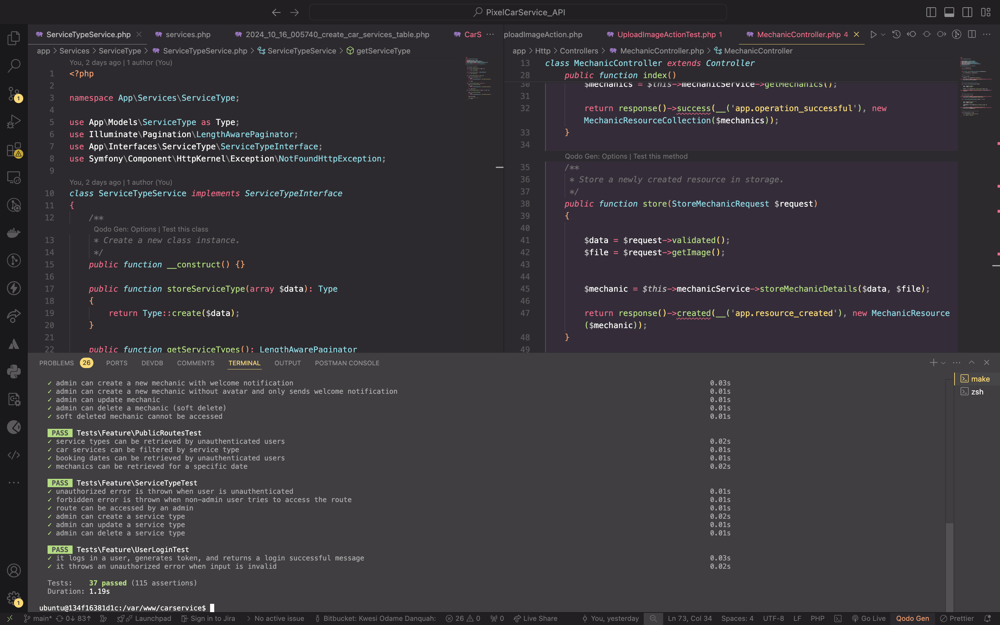

# Pixel Car Service API

Welcome to the Car Service Booking API backend, the server-side component of the car service booking application. This backend is built with Laravel and provides RESTful APIs for managing car services, mechanics, and bookings. The backend is containerized using Docker, making it easy to set up and deploy alongside the separated frontend.

```plaintext
carservice_api/
│
├── docker-files/
│   ├── nginx/
│   │   ├── certs/             # SSL certificates (to be generated locally)
│   │   └── ...
│   └── ...
├── docker-compose.yml         # Docker Compose file for orchestrating containers
├── app/                       # Laravel application files
├── docs/                      # Documentation for API routes and other functionalities
│   ├── authentication/        # Authentication-related route documentation
│   │   └── README.md          # Documentation for authentication-related routes
|   └── ...
├── .env.example               # Example environment configuration file
├── README.md                  # This README file
└── ...                        # Other backend-related files
```

## Prerequisites

-   **Docker**: Ensure Docker is installed on your machine. [Install Docker](https://docs.docker.com/get-docker/)
-   **Make**: Make sure you have `make` installed, as it will be used to manage commands for the API.

## Setting Up the API Backend

### Step 1: SSL Certificate Setup

To secure communication between your frontend and backend, you need to generate SSL certificates. We use `mkcert` for this purpose.

-   Install `mkcert` (if not already installed):

    -   For macOS:

    ```bash
    brew install mkcert
    brew install nss # if you use Firefox
    ```

    -   For Linux and Windows, follow the instructions at mkcert’s repository.

-   Generate a local certificate

```bash
mkcert -install
mkcert localhost 127.0.0.1 ::1
```

### Step 2: Environment Variables

Before setting up the backend, configure the environment:

1.  **Copy the example `.env` file**:

    ```bash
    cp .env.example .env
    ```

2.  **Edit the `.env` file** to set database and other necessary configurations.

    ```plaintext
            DB_DATABASE=your_db
            DB_USERNAME=your_username
            DB_PASSWORD=your_password
            MAIL_MAILER=smtp

            MAIL_HOST=smtp.gmail.com
            MAIL_PORT=465
            MAIL_USERNAME=
            MAIL_PASSWORD=
            MAIL_ENCRYPTION=ssl
            MAIL_FROM_ADDRESS=
            MAIL_FROM_NAME="${APP_NAME}"
            ADMIN_SEED_PASSWORD=
            ADMIN_EMAIL=

    ```

### Step 3: Full Setup Process

To streamline the setup process, you can now use the `make setup` command, which combines building the API and setting up pre-commit hooks in one step.

#### Full Setup:

1. Run the following command to build the Docker container, install dependencies, and set up the pre-commit hooks:

    ```bash
    make setup
    ```

    This command will:

    - Build the Docker container for the API.
    - Install the pre-commit hook (used for running lint checks before commits).

#### Running the API

1. **Start the API**:

    ```bash
    make up
    ```

2. **Enter the API Shell and Install Dependencies**:

    ```bash
    make shell
    composer install
    ```

3. **Run Tests in the shell**:

    ```bash
    php artisan test
    ```

    

4. **View Logs**:

    ```bash
    make logs-api
    ```

5. **Stop the API**:

    ```bash
    make down
    ```

This approach allows for cleaner code and makes route name updates easier by centralizing route name management.

## Automated Code Checks on Push

To ensure that the codebase remains clean, consistent, and free from errors, we have automated several checks that run during the commit and push processes.

### Pre-Push Hook

Before pushing the code, the application’s test suite is automatically executed to ensure that all tests pass successfully:

-   **Run Tests:** Ensures that all tests pass before allowing the push to proceed.

These checks are put in place to help maintain code quality, catch potential issues early, and ensure that error-prone code is not pushed to the repository.

## Communication with the Frontend

The API provides RESTful endpoints that the frontend interacts with. Ensure that the frontend app is configured to communicate with the backend API, typically at `https://localhost:8894`.

## Route Documentation

All API routes are documented in the `docs` folder. [Routes Documentation](docs/routes)

## Additional Commands

### Makefile Commands for the API

-   **setup**: Build the docker containers and set up pre-commit hooks.
-   **up**: Start the containers in detached mode.
-   **down**: Stop and remove the Docker containers.
-   **logs-api**: View real-time logs from the containers.
-   **shell**: Access the carservice container shell.
-   **lint**: Run PHP CodeSniffer for PSR-12 code standard checks.
-   **lint-fix**: Fix linting issues automatically.
-   **analyze**: Run static analysis using PHPStan.

## Contributing

Contributions are welcome! Please fork the repository and submit a pull request. Make sure to follow the code style guidelines and provide clear commit messages.

## License

This project is licensed under the MIT License. See the [LICENSE](LICENSE) file for details.

## Contact

For inquiries, suggestions, or support, please reach out to us at support@pixelcarservice.com
